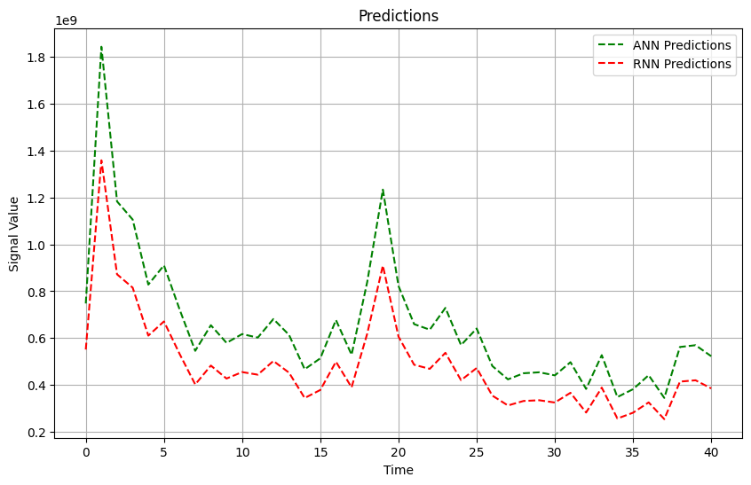

# AI-DOT-BOT

Artificial Intelligence Driven Options Trading Bot incorporates highly developed deep learning models like Artificial Neural Networks (ANN) and Recurrent Neural Networks (Long Short-Term Memory or LSTM) to accurately predict closing prices of options contracts. It features many advanced techniques and optimizations, including:

- **Adam Optimizer**: For efficient and adaptive learning rates.
- **StandardScaler**: To normalize features for improved model performance.
- **Rectified Linear Unit (ReLU) Activation Function**: For non-linear transformations and handling the vanishing gradient problem.
- **L1 & L2 Regularizers**: To prevent overfitting by adding penalties on layer parameters.
- **Reduce LR On Plateau**: For dynamic learning rate adjustment when a metric stops improving.
- **Early Stopping Techniques**: To halt training when performance stops improving to prevent overfitting.

### Features and Enhancements:
- **Advanced Model Architectures**: Incorporates both ANN and LSTM for robust prediction capabilities.
- **Comprehensive Preprocessing**: Data normalization and noise reduction for clean input data.
- **Extensive Performance Metrics**: Including Mean Absolute Error (MAE) and Root Mean Squared Error (RMSE) for evaluation.
- **Visualizations for Analysis**: Various plots and graphs for deep insights into model performance and predictions.

### Visual Results and Analysis:
1. **Line Plot and Box Plot after Preprocessing**: These plots help in visualizing the variation in data and identifying any noise present. They provide a clear understanding of data distribution and outliers.
   
   
   

2. **ANN and RNN Model Architecture**: Visual representations of the model architectures used in the bot. These diagrams illustrate the layers and connections in the ANN and RNN models.
   
   
   

3. **MAE and RMSE Values**: Displaying the Mean Absolute Error and Root Mean Squared Error values to evaluate the model's performance. Lower values indicate better accuracy.
   
   
   
   Over 700 epochs, the ANN model achieves a decreasing loss trend, starting from 18146.8594 and converging to 0.8291, while the RNN model’s loss decreases from 18159.8281 to 3.8581 over 200 epochs. Lower validation loss values for both models (0.8663 for ANN and 4.4566 for RNN) indicate effective generalization to unseen data. In terms of evaluation metrics, the ANN model yields an MAE of 0.37 and RMSE of 0.47, while the RNN model has an MAE of 1.18 and RMSE of 1.58. These values signify that the ANN model exhibits superior predictive accuracy and precision compared to the RNN model. Overall, the decreasing loss trends and relatively low validation loss values underscore
the models’ effective learning and generalization capabilities, with the ANN model outperforming the RNN model in predictive accuracy.

4. **Training and Validation Loss Curve**: This plot shows the loss during training and validation phases, helping to understand if the model is overfitting or underfitting.
   
   
   
   This provides insights into how well the model is learning from the training data and how well it generalizes to unseen data. A decreasing training loss indicates that the model is improving its fit to the training data over epochs, while the validation loss gives an indication of how well the model is performing on data it has not seen before. Ideally, both training and validation losses should decrease over time, indicating that the model is learning effectively without overfitting to the training data.

   

5. **Histogram of Actual vs Predicted Values**: A histogram comparing the actual and predicted values to visualize the distribution and accuracy of the model's predictions.
   
   
   
   Ideally, the histograms of actual and predicted values should overlap closely, indicating that the model’s predictions align well with the actual outcomes.
   Differences between the histograms may highlight areas where the model struggles to accurately predict certain values.

6. **Line Graph of ANN and RNN Predictions**: This graph compares the predictions made by the ANN and RNN models against the actual values over time.
   
      

7. **Plotted Generated Signals on Stock Chart**: Visual representation of the generated buy-only signals (for now) overlaid on the stock price chart for the given period. This helps in understanding the timing and effectiveness of the trading signals. Green triangles indicate suggested call option purchases, while red triangles represent opportunities to buy put options.
   
   

   The consistent alignment between the predictions of the Artificial Neural Network (ANN) and the Recurrent Neural Network (RNN) indicates a good performance across both models.
   Such resemblance in forecasts implies a good level of confidence in the models’ ability to capture and interpret patterns within the data.

### How to Use:
1. **Data Preparation**: Ensure your data is preprocessed and normalized using techniques like StandardScaler.
2. **Model Training**: Train the ANN and RNN models using the provided architecture and techniques.
3. **Prediction and Evaluation**: Use the trained models to predict closing prices and evaluate performance using MAE and RMSE.
4. **Signal Generation**: Generate trading signals based on model predictions and visualize them on stock charts.
5. **Visualization**: Use the various plots to analyze data variation, model performance, and trading signals.

### Requirements:
- Python 3.x
- TensorFlow/Keras
- Scikit-learn
- Matplotlib/Seaborn for plotting
- Pandas for data manipulation

### Running the Bot:
1. **Preprocess the data**: Normalize and clean your input data.
2. **Train the models**: Train ANN and RNN models.
3. **Generate predictions**: Use the trained models to make predictions.
4. **Visualize results**: Use the visualization functions to generate plots and analyze results.
5. **Generate trading signals**: Use the predictions to generate buy/sell signals and plot them on the stock chart.

### Conclusion:
AI-DOT-BOT is designed to leverage the power of deep learning for predictive accuracy in options trading. With advanced models and comprehensive visualizations, it provides a robust framework for developing and analyzing trading strategies. Further development and incorporating more features for higher accuracy and better prediction is still a scope for the future. In future iterations, this project could incorporate live news sentiment analysis to enhance trading predictions. By integrating sentiment analysis of real-time news data, the system could dynamically adjust trading signals based on market sentiment, news events, and other external factors. This integration would enable the model to react to changing market conditions more effectively and potentially improve the accuracy of trading predictions. 

_This project is still under development._
